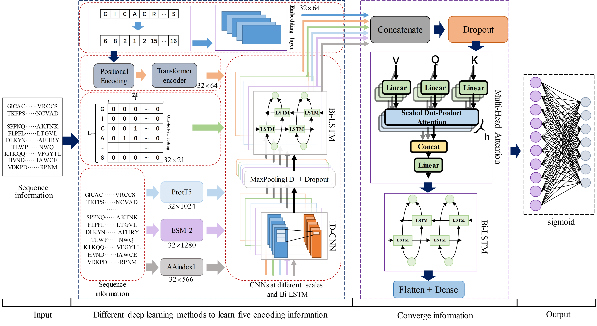

# BPFun
BPFun: A Deep Learning Framework for Bioactive Peptide Function Prediction Using Multi-label Strategy by Transformer-driven and Sequence Rich Intrinsic Information
## Introduction
Background and significance:  

  
Bioactive peptides are small molecule peptides that possess multiple biological functions. Bioactive peptides play an important role in regulating various functions of the body, and peptide drugs also have various advantages. In recent years, with the discovery of a large number of bioactive peptides, people have gradually realized that they may have multiple different functions. Therefore, efficient and accurate prediction of multifunctional bioactive peptides can greatly promote the research of biological functional mechanisms and drug development. Although more and more bioactive peptides have been identified through experiments, it is still challenging to clearly identify all the functions of bioactive peptides. Therefore, as an alternative to experimental work, identifying bioactive peptides through computers can effectively assist in experimental identification and also solve the time-consuming and labor-intensive shortcomings in experimental research.  

  
Result:  

  
We achieved good results in both five fold cross validation and independent test set validation, using five different feature information and optimized models with added attention mechanisms. Their accuracy rates were 65.80% and 65.77%, respectively, higher than other models and methods tested on the same dataset. After using data augmentation methods, the imbalance between categories within our data has been effectively improved, especially the sensitivity of anti angiogenic peptides and antioxidant peptides has significantly increased. It can also achieve good accuracy in actual case testing.  

Model:  

## Related Files
### BPFun
| File Name   | Description |
| ----------- | ----------- |
| getdata.py      | get data and process       |
| train.py   | train model        |
| test.py   | test model result        |
| predictor.py   | use model prediction        |
| data   | data        |
| test   | instance test data        |
| aaindex1_test.py   | aaindex1 encoded        |
| aaindex1.my.csv   | physicochemical properties of amino acids        |
| esm_test.py   | ESM-2 model        |
| prot_t5.py   | ProtT5 model        |
| transformer.py   | transformer encode and positional embedding         |
| evalution.py   | evaluation metrics (for evaluating prediction results)        |
| model.py   | model construction        |
## Requirements
python==3.7
Keras==2.10.0
Keras-Preprocessing==1.1.2
numpy==1.21.1
pandas==1.5.2
scikit-learn==1.3.0
scipy==1.10.1
tensorboard==2.10.1
tensorflow-gpu==2.10.1
## How to use
1.get data  (ProtT5 and ESM-2 need to download models)
    
    `python3 getdata.py`
2.train  

    `python3 train.py`
3.test  

    `python3 test.py`
4.predictor  

    `python3 predictor.py`
